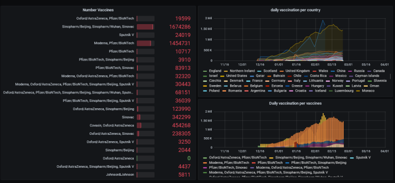

[](https://www.docker.com)
[](https://docs.docker.com/compose/)
[](https://grafana.com)
[](https://www.mysql.com)

[](https://opensource.org/licenses/MIT)


## Projet
---
## Etape 1
### Connexion au seveur
```bash
ssh user@IpDuServeur
```
### Ghit clone
```bash
git clone https://github.com/CLOATRE-Erwan/Grafana-mysql_docker

## Etape 2
### Docker-compose
```bash
pip install docker-compose
```

### Creation du fichier yml

```yml
version: '2'
services:

  # simple myself setup
  mysql:
    image: mysql:5.7
    container_name: mysqldb
    ports:
      - "3306:3306"
    environment:
      MYSQL_ROOT_PASSWORD: 1234

  # grafana used for graphing mysql data
  grafana:
    image: grafana/grafana
    container_name: grafana
    ports:
      - '80:3000'
    environment:
      GF_INSTALL_PLUGINS: percona-percona-app
```

```shell
docker-compose up -d
```

## Etape 2
### Mysql

Mise en place des donne mysql dans le volume

```bash
docker cp file.sql <CONTAINER ID>:/
```

Crée la base de donne

```shell
docker exec -it container_id bash
```

```shell
mysql -uroot -ppassword 
```

```mysql
CREATE DATABASE CRKI
USE CRKI
SOURCE file.sql
```


## Etape 3

A partir de l'ip du serveur et du port de Grafana



