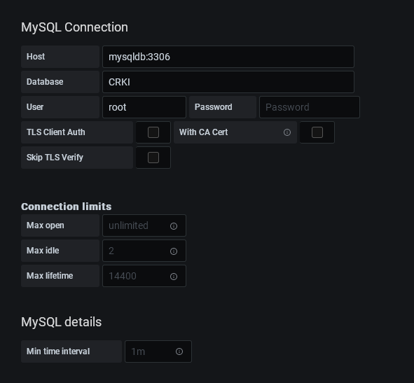

[](https://www.docker.com)
[](https://docs.docker.com/compose/)
[](https://grafana.com)
[](https://www.mysql.com)

[](https://opensource.org/licenses/MIT)


## Projet
---
## Etape 1 : Instalation des prérequis
### Connexion au seveur
```bash
ssh user@IpDuServeur
```


### Git clone
```bash
git clone https://github.com/CLOATRE-Erwan/Grafana-mysql_docker.git
```


### Docker-compose
```bash
pip install docker-compose
```

## Etape 2 : Up

```bash
docker-compose up -d
```

## Etape 3 : Resultats

A partir de l'ip du serveur et du port de Grafana





